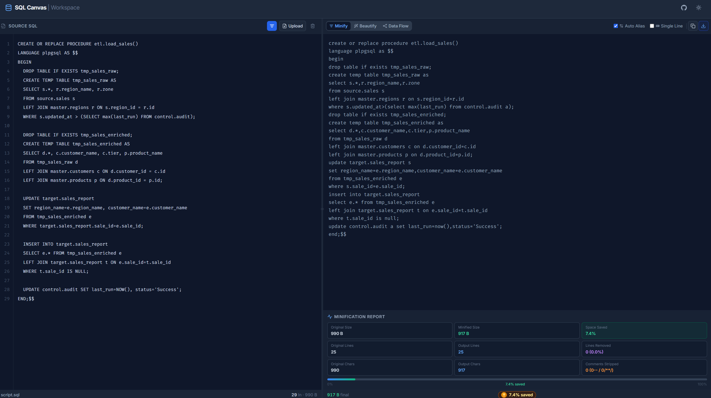
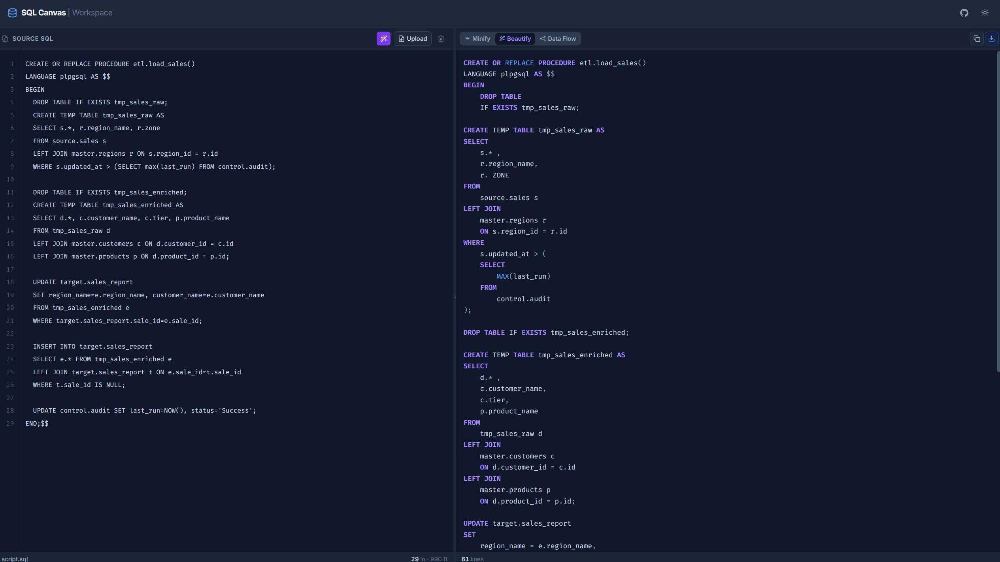
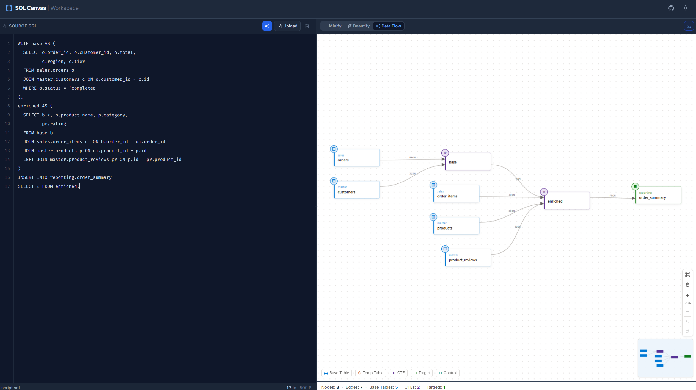

# SQL Canvas

**SQL Canvas** is a high-performance Single Page Application that instantly **formats, cleans, compresses, and visualises SQL scripts** — entirely in your browser, with no backend, no build steps, and no data ever leaving your machine.

---

## Live Demo

Try it out instantly: **[SQL Canvas](https://bh00t.github.io/SQL-Canvas/)**

---

## Screenshots

**Minify** — strips comments, whitespace, and auto-generates aliases. 40%+ size reduction on real scripts.

**Beautify** — transforms a single-line mess into clean, indented, syntax-highlighted SQL.

**Data Flow** — visualises SQL lineage as an interactive node-graph with CTEs, tables, and targets.

---

## Getting Started

No installation required.

1. Visit the [Live Demo](https://bh00t.github.io/SQL-Canvas/), **or**
2. Download `index.html` and open it in any modern browser.

That's it — the entire application is a single self-contained file.

---

## Key Features

### Zero Setup
The entire application lives in a single `index.html` file. No `npm install`, no build process, no local server — just open it in a browser and start working.

### Secure Client-Side Processing
All parsing, tokenization, and formatting happen locally in your browser. Your SQL never leaves your machine.

### Advanced AST-Driven Minification
- **Two-Pass Engine** — safely strips `--` and `/* */` comments and unnecessary whitespace without breaking string literals or complex operators.
- **Smart Auto-Aliasing** — optionally generates compact aliases for unaliased tables to reduce script size.
- **Single-Line Output** — collapses the entire script into one continuous line for maximum compression.
- **Detailed Reports** — view original vs. minified size, space saved, and counts of characters, lines, and comments removed.

### Intelligent SQL Beautifier
- **Context-Aware Indentation** — handles subqueries, `CASE` statements, `JOIN` conditions, and block statements (`BEGIN ... END`).
- **Keyword Normalisation** — converts SQL keywords and functions to uppercase while preserving identifier casing.
- **Edge-Case Handling** — supports PostgreSQL casts (`::`), concatenations (`||`), and assignment operators (`:=`).
- **Live Syntax Highlighting** — lightweight custom highlighter for keywords, functions, strings, and numbers.

### Interactive Data Flow Diagram
- **Visual SQL Lineage** — automatically parses your SQL and renders an interactive node-graph showing how tables, CTEs, and targets connect.
- **Node Types** — distinguishes Base Tables, Temp Tables, CTEs, Targets, and Control nodes, each with distinct colours and icons.
- **Smart Layout** — topological column-based layout with gravity-driven vertical alignment for clean, readable diagrams.
- **Minimap** — 160×110 px overview panel with a live viewport indicator for navigating large diagrams.
- **Full Interactions** — pan, zoom, drag individual nodes, rubber-band multi-select, group drag, and undo/redo.
- **Schema Grouping** — nodes sharing a schema are visually grouped with a bounding box.
- **Node Detail Panel** — click any node to inspect its upstream sources and downstream targets.
- **PNG Export** — download the rendered diagram as a PNG image.

### Highly Interactive UI
- **Split-Pane Design** — resizable input and output panels with persisted split position.
- **Drag & Drop** — drop `.sql` or `.txt` files directly onto the editor to load instantly.
- **Dark / Light Mode** — theme preference is saved and restored across sessions, defaulting to light mode on first visit.
- **Quick Export** — one-click Copy to Clipboard and Download as `.min.sql` or `.fmt.sql`.
- **Line-Numbered Editor** — monospaced editor with a synchronised gutter for easy reference.

---

## How to Use

1. **Load your SQL** — paste it into the left editor, or drag and drop a `.sql` file onto the panel.
2. **Choose a mode:**
   - **Minify** — press `Ctrl+Enter` / `Cmd+Enter`, or click the Minify button. Toggle **Auto-Alias** or **Single Line** for extra compression. Use the lightbulb icon to view the savings report.
   - **Beautify** — click the Beautify tab to format and syntax-highlight your SQL.
   - **Data Flow** — click the Data Flow tab to visualise your SQL as an interactive dependency diagram.
3. **Export** — click **Copy** to copy the output to clipboard, **Download** to save the file, or use the export button in the Data Flow tab to save the diagram as a PNG.

---

## Supported SQL Dialects

SQL Canvas works with all major SQL dialects:

- Amazon Redshift
- PostgreSQL
- MySQL
- Snowflake
- Google BigQuery

---

## Technology Stack

| Layer | Technology |
|---|---|
| Core | HTML5, JavaScript (ES6+) |
| UI Framework | React 18 (via ESM import map) |
| Styling | Tailwind CSS (CDN) |
| Compiler | Babel Standalone (JSX on the fly) |
| Icons | Lucide React |
| Diagram Rendering | HTML5 Canvas API (custom engine) |
| Architecture | Custom lexical analysers and AST tokenisers |

---

## Browser Compatibility

SQL Canvas works in all modern browsers. The following are recommended:

- Google Chrome 90+
- Mozilla Firefox 88+
- Microsoft Edge 90+
- Safari 14+

> **Note:** Opening `index.html` directly via `file://` may restrict some browser APIs (e.g., clipboard, Service Worker). For full functionality, use the [Live Demo](https://bh00t.github.io/SQL-Canvas/) or serve the file through a local server.

---

## Contributing

Bug reports, feature requests, and pull requests are welcome.

- **Bugs** — open an issue with a clear description and a minimal SQL example that reproduces the problem.
- **Features** — open an issue first to discuss the idea before submitting a PR.
- **Pull Requests** — keep changes focused and include a brief description of what was changed and why.

---

## Acknowledgements

Built with the help of AI tools. Core SQL parsing, formatting, and diagram layout logic is custom-written and browser-native.